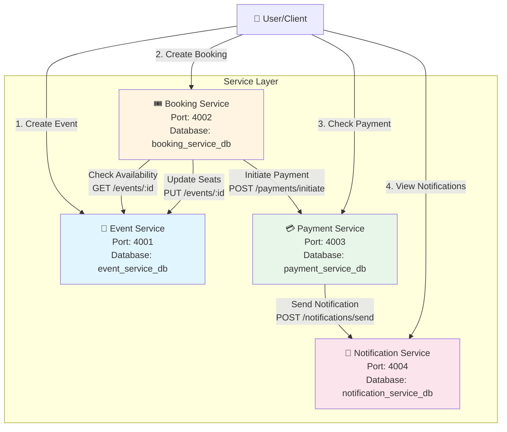
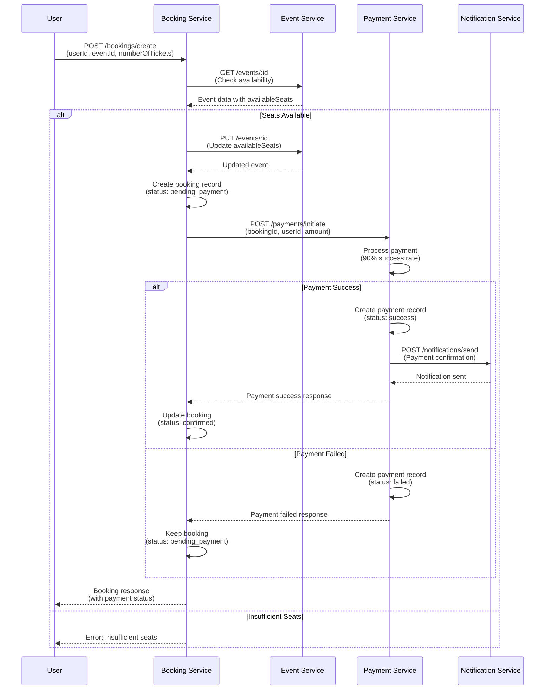
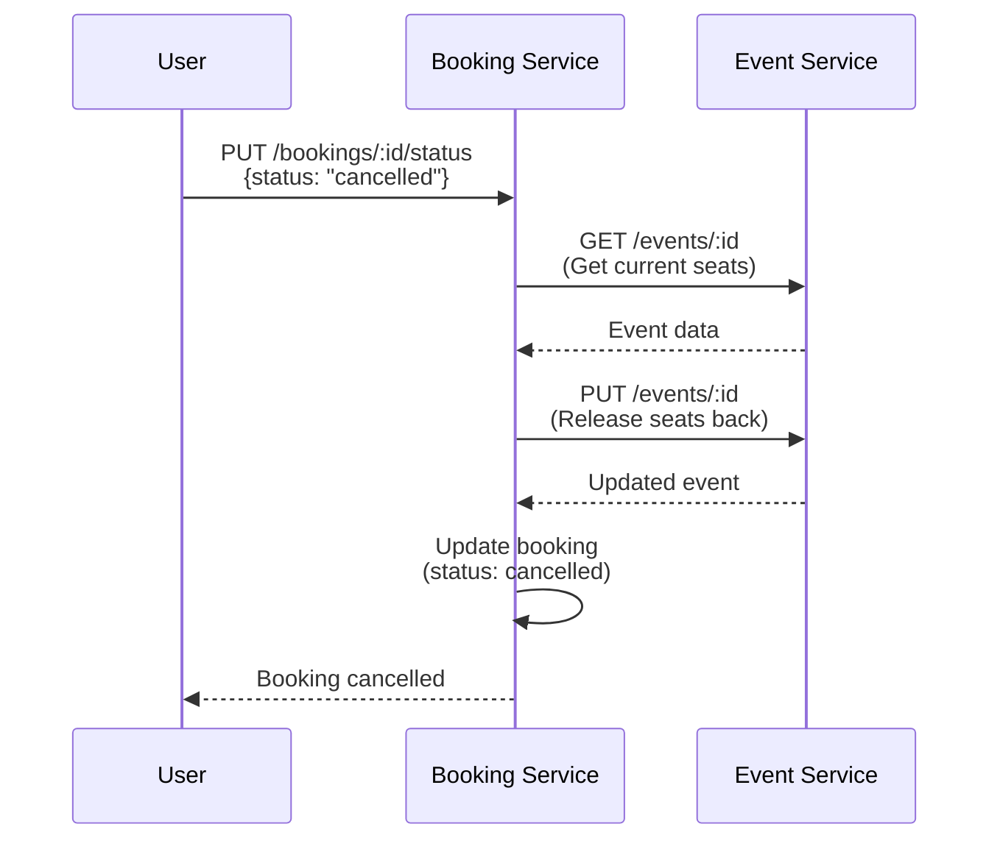

# Service Communication Diagram

## Architecture Overview

This diagram shows how the 4 services communicate with each other in the Event Management & Ticket Booking System.



---

## Detailed Booking Flow Diagram



---

## Service Communication Matrix

| From Service | To Service | API Call | Purpose |
|-------------|------------|----------|---------|
| **Booking Service** | **Event Service** | `GET /events/:id` | Check event availability |
| **Booking Service** | **Event Service** | `PUT /events/:id` | Update available seats |
| **Booking Service** | **Payment Service** | `POST /payments/initiate` | Process payment |
| **Payment Service** | **Notification Service** | `POST /notifications/send` | Send confirmation |

---

## Cancellation Flow



---

## Service Dependencies

```
┌─────────────────────────────────────────┐
│         Event Service (4001)            │
│  ┌──────────────────────────────────┐   │
│  │  No dependencies                 │   │
│  │  Standalone service             │   │
│  └──────────────────────────────────┘   │
└─────────────────────────────────────────┘
              ▲
              │ (called by)
              │
┌─────────────────────────────────────────┐
│       Booking Service (4002)            │
│  ┌──────────────────────────────────┐   │
│  │  Depends on:                    │   │
│  │  • Event Service (4001)         │   │
│  │  • Payment Service (4003)       │   │
│  └──────────────────────────────────┘   │
└─────────────────────────────────────────┘
              ▲
              │ (called by)
              │
┌─────────────────────────────────────────┐
│       Payment Service (4003)            │
│  ┌──────────────────────────────────┐   │
│  │  Depends on:                    │   │
│  │  • Notification Service (4004)  │   │
│  └──────────────────────────────────┘   │
└─────────────────────────────────────────┘
              ▲
              │ (called by)
              │
┌─────────────────────────────────────────┐
│    Notification Service (4004)         │
│  ┌──────────────────────────────────┐   │
│  │  No dependencies                 │   │
│  │  Standalone service             │   │
│  └──────────────────────────────────┘   │
└─────────────────────────────────────────┘
```

---

## API Endpoints Summary

### Event Service (4001)
- `POST /events/add` - Create event
- `GET /events/` - List all events
- `GET /events/:id` - Get event by ID
- `PUT /events/:id` - Update event
- `DELETE /events/:id` - Delete event

### Booking Service (4002)
- `POST /bookings/create` - Create booking
- `GET /bookings/:userId` - Get user bookings
- `PUT /bookings/:id/status` - Update booking status

### Payment Service (4003)
- `POST /payments/initiate` - Process payment
- `GET /payments/:id/status` - Get payment status

### Notification Service (4004)
- `POST /notifications/send` - Send notification
- `GET /notifications/user/:id` - Get user notifications

---

**Note**: These Mermaid diagrams will render automatically on GitHub. For other platforms, you can use online Mermaid editors like [mermaid.live](https://mermaid.live).

